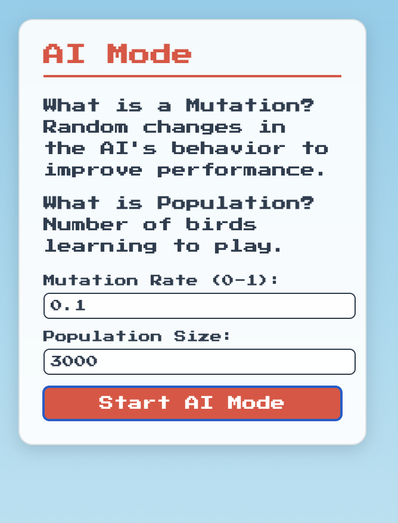

# Play and Explore!

_This is the AI Mode control panel. You can change the Mutation Rate and Population Size, then click ‘Start AI Mode’ to watch the birds learn!_
Now you know the secrets, try these:

1. Change the "Population Size" in AI Mode (e.g., 100 birds). Does it learn faster?
2. Adjust the "Mutation Rate." More changes—does it help or hurt?
3. Watch the "Score" in later generations. How high can it get?

**Challenge**: Can you beat the AI’s best score in Human Mode? You’ve got one bird, but you’re super smart!
