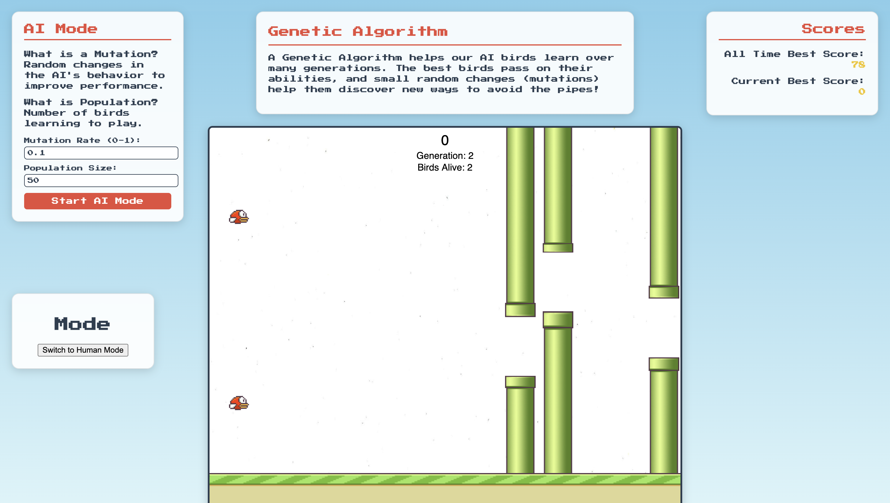

# What’s Happening in the Game?

When you switch to AI Mode and click "Start AI Mode," 50 birds start flapping. At first, they crash a lot (oops!). But over time, they get smarter. You saw numbers like "Generation," "Birds Alive," and "Score" on the screen. Here’s what they mean:

- **Score**: How many pipes the birds pass without crashing.
- **Generation**: A new group of birds, like a new "class" of students learning from the last one.
- **Birds Alive**: How many birds in the group are still flying and not crashed.

**Fun Question**: Did you notice the "Birds Alive" number drop fast at first, then slower in later generations? Why do you think that happened?

---

_This is what the game looks like in AI Mode. See the numbers at the top? That’s where "Score," "Generation," and "Birds Alive" show up!_
